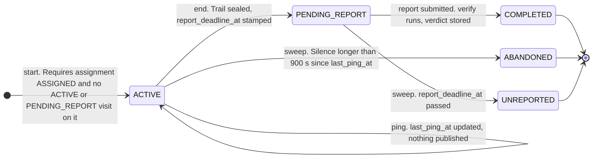
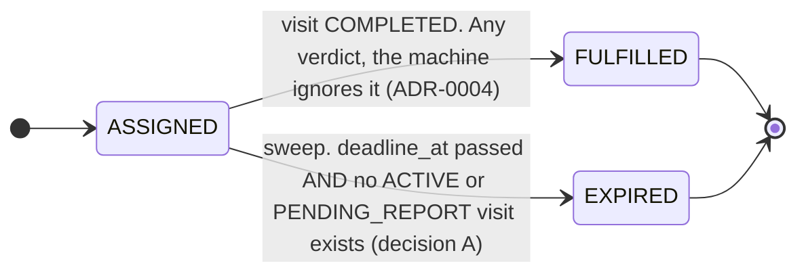

# fieldproof: system design

The writeup for the location-verified visit tracking slice. Vocabulary is
`CONTEXT.md`; each decision's rejected alternatives are in `docs/adr/`; the
buildable detail (constants, schema, endpoints) is
`.scratch/location-verified-visits/spec.md`. This document is the argument that
joins them: what the system is, how it judges a visit, what was measured, what
it would take to scale, and what it deliberately does not do.

## 1. Architecture

Six layers, each one paragraph. The dependency arrows point inward: the browser
talks only to the HTTP layer, the HTTP layer and the sweeper both call the pure
core and the persistence layer, and the pure core imports nothing above it.

**Participant client** (`frontend/src/app/participant-flow/`, Angular 21,
standalone, zoneless, unstyled semantic HTML). One component walks landing →
consent → active → closed or report → done. Consent comes before anything
tracks and owns the first `getCurrentPosition` call, so a participant who denies
permission is told the visit will be unverifiable before Start is offered, and
Start is never blocked. The active screen runs `setInterval` with
`getCurrentPosition` every 15 seconds (not `watchPosition`, which fires on
movement and a participant standing still in a shop may never move), holds a
Screen Wake Lock re-requested on every `visibilitychange`, and treats a 409 on
any ping or on End as terminal: stop the interval, release the lock, show the
closed screen with a path to a new visit. The page calls `/api` on its own
origin; the dev server serves HTTPS (iOS refuses geolocation to anything else)
and proxies to the API so no mixed-content request is ever made.

**Trust boundary** (`src/fieldproof/api.py`). Five participant endpoints and two
dashboard routes, and nothing the browser says is believed on its own terms. The
server stamps `received_at` with no seam, no header and no injectable clock;
`reported_at` is stored beside it as a tamper signal and never scored on.
Pydantic refuses what would corrupt judgement: `accuracy_m` below zero (a
negative half-width shrinks the uncertainty interval and turns an outside ping
conclusively inside), naive timestamps, and unknown fields. Two rejections that
are never confused: 409 means the visit has no such move and the client stops
for good; 422 means this one reading is stale and the interval keeps running.
Every read-then-write across an `await` takes `SELECT ... FOR UPDATE` on the
visit, and the report handler locks the assignment too, so the request path and
the sweeper never write over each other. Every handler commits, then publishes.

**Pure core** (`verification.py`, `transitions.py`, `geo.py`). No clock, no
database, no I/O; callers pass values in (ADR-0002). `verify` turns a sealed
ping trail, the assignment's terms, the server-clock visit duration and a
versioned scoring config into a verdict with its full breakdown (section 2).
`transitions` holds both state machines as closed tables: every legal move is a
dict entry or a `match` arm, and anything absent raises, so the fifteen moves
out of a terminal visit state are unrepresentable rather than guarded against.
`geo` is haversine and the target-location type, kept out of `verification`
because judgement consumes stored distances and never sees a coordinate.

**Persistence** (`schema.py`, `database.py`, Postgres over asyncpg). Five
tables: `assignment`, `visit`, `ping`, `report`, `verdict`. Every timestamp is
`timestamptz`. Two rules live in the database because application code cannot
hold them across concurrent requests: a partial unique index allows at most one
`ACTIVE` or `PENDING_REPORT` visit per assignment (ADR-0001), and unique
constraints allow one report and one verdict per visit. `distance_m` is
computed once at ingest and stored, so verification is an aggregate over an
indexed `(visit_id, received_at)` range rather than a recomputation. The
`verdict` row carries the whole breakdown plus the `radius_m`,
`min_duration_s` and scoring config version it was computed under, so a stored
result traces to the rules that produced it. There is no migration tool; the
schema is built from the models, and that narrowing is recorded on
`database.py`.

**Sweeper and event bus** (`sweeper.py`, `events.py`). Three of the system's
transitions, `ABANDONED`, `UNREPORTED` and `EXPIRED`, are produced by nothing
happening: no request is behind them. One `asyncio` task ticks every 10 seconds
and runs three sweeps, each in its own transaction so one failing cannot roll
back the others, each under the same row locks the handlers take, each
publishing only after its commit. The bus is an in-process registry of
`asyncio` queues, one per connected dashboard. The sweeper and the API handlers
move visits through the same `transition_visit` call and publish the same event
types, and those types carry no origin field, so a dashboard cannot tell which
path produced an event. A dead sweeper looks exactly like a quiet one, so every
sweep and the loop itself are caught and logged, the task carries a
done-callback that logs at critical if it ever ends, and shutdown waits for it
with a bound.

**Dashboard stream** (`dashboard.py`, `frontend/src/app/dashboard/`). The
business's view is snapshot-then-stream over Server-Sent Events (ADR-0006):
subscribe to the bus first, then take one outer-joined `SELECT` for the whole
dashboard, then relay events as they arrive, with a keepalive comment every 15
seconds so a vanished client is discovered. That order is the correctness
argument: a transition that commits after the snapshot publishes after it, and
a queue registered before the snapshot holds it. The cost is that a transition
in the gap can arrive twice, which is harmless because a delta carries the
absolute state. Reconnection is a fresh snapshot from a fresh subscription; there
is no event store and no replay. The client's model is three pure functions
(`fromSnapshot`, `applyVisit`, `applyAssignment`) and one template. A
`COMPLETED` delta carries the verdict breakdown, so the client never
re-snapshots to render a report. Nothing on the wire is a coordinate, a ping or
an accuracy figure (ADR-0005), and the snapshot test walks every key of the
payload to prove it.

## 2. The verification algorithm

`verify(ping_trail, terms, visit_duration_s, config) -> Verification`. Pure.
Three stages, and the order of the third is the design.

**Classify.** Each ping has a stored `distance_m` from the target, its
client-reported `accuracy_m`, and the assignment's `radius_m`. Accuracy is an
uncertainty interval, never a trust weight (ADR-0003):

```
INSIDE        if distance + accuracy < radius
OUTSIDE       if distance - accuracy > radius
INCONCLUSIVE  otherwise
```

The rule was hand-worked on paper before the issue 02 design was accepted:
`docs/experiments/interval-rule-notebook.pdf`.

A ping whose interval straddles the radius counts for neither side. There is no
accuracy cutoff: `accuracy: 800` against a 100 m radius is already inconclusive
by arithmetic, and `accuracy: 3` earns nothing a real 3 m fix would not.
Classification is re-derived inside `verify` rather than read from the ping
row, because it depends on the radius and re-scoring under a different radius
has to be able to reach a different answer.

**Attribute.** Walk the conclusive pings in `received_at` order (sorted inside
the function; a replay from stored rows does not owe it a sort) and look at each
adjacent pair. If the gap is at most `GAP_ATTRIBUTION_LIMIT_S` (60 s) and both
pings agree, the gap's seconds are attributed to that class. A gap that is too
long, or a pair that disagrees, is unattributed: the crossing was not observed,
and an invented split would sit in a field the business reads as measured.
Inconclusive pings are skipped, not treated as breaks. Everything unattributed
(a pocketed phone, a denied permission, a walk from outside to in) counts for
neither side. Absence of evidence is not evidence.

**Judge.** Duration first, and it is the only gate that does not read the trail:

```
attributed_total = inside_s + outside_s
dwell_ratio      = inside_s / attributed_total          (0 if total is 0)

if visit_duration_s < min_duration_s:        suspicious
elif attributed_total < SUFFICIENCY_S (180):  unverifiable
elif dwell_ratio >= DWELL_RATIO_MIN (0.80):   verified
else:                                         suspicious
```

`visit_duration_s` is `ended_at - started_at` on the server clock, passed in and
never derived from the trail; the trail is empty in exactly the case where this
value decides the verdict. Putting duration first matters because every
mechanism that justifies `unverifiable` (pocketed phone, denied permission,
indoor accuracy) destroys pings without shortening the visit, so the two tests
are orthogonal and the reorder touches only visits that are both too short for
the task and too thin on evidence. That region is `suspicious` on purpose: under
sufficiency-first a 90-second all-inside sprint scores `unverifiable` and never
reaches the duration check, which makes brevity the cheapest way to launder a
visit that was never performed. The counter-case is accepted rather than argued
away: permission denied on a 60-second visit against a 300-second task is
`suspicious`, because there is no innocent account of that, and a short visit is
only ever judged when the participant explicitly ended it and reported against
it (an abandoned visit never reaches verification).

The decision that settled this order was reversed once during spec generation
and caught before any code existed; `docs/ai-log.md` (2026-09-02) has the
trace.

**Worked example.** Terms: `radius_m` 100, `min_duration_s` 300. Config v1.
A 600-second visit with 34 pings at the client's 15-second cadence:

| Offset from start    | Pings | distance | accuracy | Class        | Why                                                                                       |
| -------------------- | ----- | -------- | -------- | ------------ | ----------------------------------------------------------------------------------------- |
| 0, 15, 30, 45 s      | 4     | 150 m    | 20 m     | OUTSIDE      | 150 − 20 = 130 > 100 (walking in from the car park)                                       |
| 60 … 300 s           | 17    | 30 m     | 20 m     | INSIDE       | 30 + 20 = 50 < 100                                                                        |
| 300 → 420 s          | none  |          |          |              | phone locked in a pocket for two minutes                                                  |
| 420 … 540 s          | 9     | 30 m     | 20 m     | INSIDE       | as above                                                                                  |
| 555, 570, 585, 600 s | 4     | 40 m     | 90 m     | INCONCLUSIVE | 40 + 90 = 130 is not < 100, and 40 − 90 is not > 100 (stepped indoors, accuracy degraded) |

Attribution over the 30 conclusive pings:

| Pairs                                                             | Seconds | Goes to                                     |
| ----------------------------------------------------------------- | ------- | ------------------------------------------- |
| 0→15, 15→30, 30→45 (both OUTSIDE)                                 | 45      | outside                                     |
| 45→60 (OUTSIDE then INSIDE)                                       | 15      | unattributed: the crossing was not observed |
| 60→300, sixteen 15 s gaps (both INSIDE)                           | 240     | inside                                      |
| 300→420 (120 s > 60 s limit)                                      | 120     | unattributed: the pocket                    |
| 420→540, eight 15 s gaps (both INSIDE)                            | 120     | inside                                      |
| 540→(555…600 are inconclusive, skipped; no later conclusive ping) | 60      | unattributed                                |

Totals: `inside_s` 360, `outside_s` 45, `attributed_total_s` 405,
`unattributed_s` 195 (600 − 405), `dwell_ratio` 360 / 405 = 0.889,
`conclusive_pings` 30 of 34.

Judge: 600 ≥ 300, so the duration gate passes. 405 ≥ 180, so there is enough to
judge. 0.889 ≥ 0.80, so the verdict is **`verified`**, and the two minutes in
the pocket cost nothing. These numbers were produced by running the shipped
`verify` on exactly this trail.

Three counterfactuals on the same trail, each one line of the algorithm:

- **Same trail, visit ended at 290 s** (the participant left early): the
  duration gate fails first. `suspicious`, whatever the pings say.
- **Same trail re-scored at `radius_m` 50** (ADR-0002's "what would this have
  been at a tighter radius?"): 30 + 20 = 50 is not < 50, so every inside ping
  becomes inconclusive; only the 45 s outside remains attributed, below the
  180 s sufficiency floor. `unverifiable`, not `suspicious`: thinner evidence
  never counts against the participant.
- **Same trail re-scored at `radius_m` 200**: the four opening pings are now
  inside too (150 + 20 < 200), the crossing disappears, and everything
  attributes inside. `verified` with `dwell_ratio` 1.0.

A fourth example is real: the first verdict observed on the wire
(`docs/ai-log.md`, 2026-09-04) was an 88-second visit on a sofa against seeded
coordinates in central London, six conclusive pings all outside, dwell 0.0. The
duration gate fired first and the dashboard showed `suspicious` beside
`FULFILLED`, which is ADR-0004 observed on real data: the verdict advises, and
fulfilment ignores it.

## 3. State machines

Two machines, coupled at two points: a visit reaching `COMPLETED` fulfils its
assignment in the same transaction, and a non-terminal visit holds its
assignment's expiry back. Every move drawn is a row in `spec.md` §5; every move
not drawn raises `IllegalTransitionError`, which the API answers with 409.

**Visit.** One attempt at an assignment. There is no edge back into `ACTIVE`
from any terminal state; a participant whose visit died starts a new visit, which
is a new instance of this machine (ADR-0001). `start` is not a transition but a
guarded constructor: it needs the assignment to be `ASSIGNED` and no other visit
on it to be non-terminal, and the partial unique index referees the race the
guard cannot see.



`ABANDONED` stamps `ended_at` to `last_ping_at`, the last moment there was
evidence, not to the sweep's clock. `UNREPORTED` is terminal and unrecoverable
by design: the participant has left the site and cannot re-run a visit to attach
prose, which is why the report window defaults to 24 hours and is a fact of the
task, set per assignment.

**Assignment.** The task a business issued. `deadline_at` is a _start-by_ time.



The guard on the expiry edge is **decision A**, made on 2026-09-03 after the
sweeper's own tests found the unconditional rule expiring an assignment beneath
a visit that had started in time (started 16:59, deadline 17:00), leaving the
report that visit filed unable to fulfil anything. The guard lives as a
`NOT EXISTS` in the expiry sweep's query, not as a branch in the pure machine,
because `advance_assignment` sees one row and cannot ask about others. A visit in
flight therefore holds its assignment `ASSIGNED` past the deadline; the
assignment expires on the first sweep after that visit ends without completing
(`ABANDONED` or `UNREPORTED`), and never if it completes. Within one pass the
sweeps run abandon, unreported, expire in that order, so a visit abandoned in a
pass lets its assignment expire in the same pass.

<!-- DECISION LOG — Mohammad -->

## Decision log, in my words

1. Assignments ≠ visits

   The assignment is the job the business asks to do, the visit is one attempt the assigned person is trying to do.

   Why?

   The attempt dies. Phone dies, left screen for more than 15 minutes or session gets abandoned. If the assignment and visit are one row and have one shared status. A failed attempt kills the paid job and to make it work again you need to revive it which means editing history (abandoned thing turns to be active again) this means the state machine is lying.

   With two rows (assignments and visits) a dead visit remains dead and honest, you just start a new visit to the same assignment. Plus the attempts count becomes information for the business, (five dead attempts then a clean attempt is a pattern worth seeing).

   Alternative rejected:

   One entity(assignments) has attempts_number column, this solves the retries issue but all attempts will share the same trail’s row, which means you can’t score attempt 2 separately from attempt 1. Also each attempt has its own facts(started_at, ended_at) if we use one row each attempt will overwrite the previous attempt timestamp.

2. The verification model

   Two ideas merged into one:

   1. Pure replayable function: Don’t compute the score once and save just the number on the submission, instead keep raw pings and make the scoring a pure function (ping + target + config –> verdict), save the result and which config version produced it.

      Why: a saved number is frozen - you can’t fix the scoring bugs on old visits and you can’t answer “what is the score if I want it 150m away from the target instead of 100m?”. With the function + the kept trails you can rescore anything, anytime.

   2. Accuracy as uncertainty, never trust: The obvious design weight the precise pings higher - but accuracy is a number the client types into a JSON, so the design trusts most whoever lies best(accuracy: 3m from a spoofer outscores an honest 400m inside a mall shopper).

      The inversion: accuracy is a circle of uncertainty:

      - Circle fully inside the radius = inside.
      - Circle fully outside the radius = outside.
      - Circle straddling = count nothing.

      Lying about accuracy now buys nothing, an honest shopper’s fuzzy reading is treated as neutral instead of punished.

   Alternative rejected:

   - Score once and store (frozen, unfixable)
   - Trust weight multiplier ( rewards only the liars)

3. Fulfilment independent of verdict

   A completed visit fulfills its assignment no matter what the verdict says - the verdict set alongside it as advice.

   Why?

   The mystery shoppers are paid per fulfilled assignment. If fulfilment requires a verified verdict, a confidence threshold we pick for example 0.80 silently decides a shopper gets paid or not, and it punishes the honest people gps fails (indoor, weak phones). Paying a low-confidence visit is a business judgment that should be made by a human with evidence in front of them and not a formula’s job.

   Alternative rejected:

   Verified gate fulfilled - it turns the scoring config into a payment gate.

4. Split disclosure

   The business legitimate question is “was this person at my store?” - a raw gps trail answers a bigger one (where they walked before and after?), so the trail stays server-side (for scoring and audit). The business dashboard gets the verdict and breakdown numbers only, never a polyline. The participants get a consent screen before tracking and visible indicator during. Collecting a justified signal doesn’t license disclosing everything near it.

   Alternative rejected:

   Map on the dashboard - Showing a map on the dashboard more visually appealing but it shows more data than the business actually needs, and that’s exactly what the brief mentioned as sensitive location data.

   Score client-side and never upload - maximum privacy but verification computed by the untrusted clients is not a verification, and we cannot rescore it.

5. duration-first judgement order

   The verdict logic runs gates in order, and which gate runs first changes the product.

   Original spec draft said sufficiency first (let’s say a participant finishes a 5 minute job in 90 seconds the system under sufficiency first will see it as “not enough evidence, I refuse to judge” - Unverifiable. The issue is that this participant might just have gone for 90 seconds and did nothing which is a red flag and should count as Suspicious not Unverifiable. Under sufficiency-first, sprinting through scores better (unverifiable) than not showing up at all (suspicious) — so brevity becomes the cheapest way to launder a fake visit.

   The fix: duration first, it’s fair because duration comes from the server’s clock (ended_at, started_at) immune to every innocent thing that breaks GPS: pocketed phones, denied permission, indoor accuracy. Nothing innocent makes a 90-second session on a 5-minute job.

   Alternative rejected:

   Sufficiency first - Sounds good (don’t judge without the evidence) but it shields exactly the behavior the product designed to catch.

## 4. Measured: iOS Safari suspension (iPhone, Safari, 2026-09-01)

Test: page logging a timestamp every 15s, served locally
(`docs/experiments/pingtest.html`).

- Screen locked ~2.5 min → single gap of 147s (no ticks during lock)
- Screen locked ~5 min → single gap of 297.8s
- Backgrounded to another app ~2 min → single gap of 116.4s

In all cases suspension was total and immediate; ticks resumed
instantly on return. Gap length ≈ time away, unbounded.
Consequence: ping silence cannot distinguish "pocketed phone"
from "left the site" — timeout set to 15 min, and ping silence
on its own feeds UNVERIFIABLE, never SUSPICIOUS. (A visit shorter
than min_duration_s is SUSPICIOUS on server-clock evidence alone,
per spec.md §3; suspension never shortens a visit, so the two
never collide.) Wake Lock + explicit "keep page open" guidance is
the primary mitigation.
Caveat: one device, one browser; Android/Chrome not measured.

What the measurement set, concretely: `ABANDON_AFTER_S` is 900 rather than a
round number chosen for feel, because a 5-minute lock produced a 5-minute gap
and any shorter timeout marks honest visits abandoned. It is also why the
participant page holds a Wake Lock and re-takes it on every `visibilitychange`,
why the consent screen says the page must stay open, and why the 409 handler was
built before anything was styled: the measurement predicts a locked phone past
15 minutes fires it naturally, including mid-demo. Two days later the smoke test
reproduced this by accident (`docs/ai-log.md`, 2026-09-03): a visit whose pings
were being refused by CORS timed out at 15 minutes and its `ABANDONED` event
arrived on the dashboard stream unprompted.

## 5. Scale

The arithmetic first, because it is smaller than it sounds. A thousand
concurrent visits at the client's 15-second cadence is about 67 ping writes a
second. Each is one `INSERT` on an indexed table and one column update on the
visit row, under a row lock held for the life of one request; contention is one
request per visit per fifteen seconds. Postgres does this without noticing. What
makes it cheap is a design property rather than a tuning one: ingest is
`INSERT`-only and computes distance once at write, and scoring is an aggregate
over an indexed `(visit_id, received_at)` range that runs once per visit at
report time, never per ping. The sweeper is three indexed range scans every ten
seconds, each bounded by state. The bus carries no per-ping events at all: a
ping is a self-loop the transition function returns nothing for.

Storage is the real number. At that load the ping table grows by roughly a
quarter of a million rows an hour, and it grows linearly with active visits for
as long as the trails are kept. Retention is therefore one decision doing two
jobs (ADR-0005): reducing a trail to its verdict breakdown after N days is both
the privacy answer, since the business's interest ends at presence, and the
storage bound. It is specified and not built, and its cost is named in
ADR-0002: a reduced visit's verdict is frozen, so the replay window and the
privacy window are the same window.

What breaks first is not the database. It is the process: the sweeper and the
SSE fan-out are single-process by construction (ADR-0006, and section 6), so
the first thing that stops working under a second worker is the dashboard
missing the other worker's events.

The production path, named and not built:

- **Queued, batched ingest.** Accept the ping, enqueue, answer 202; a consumer
  batch-inserts. The endpoint already answers 202 and already withholds
  classification from the client, so the contract does not change. The row lock
  that keeps a ping off a sealed trail moves into the consumer.
- **A time-partitioned ping table**, by `received_at`. Retention becomes
  dropping a partition rather than deleting rows, and the sweeper's and
  verifier's scans stay bounded.
- **A shared event bus**: Postgres `LISTEN/NOTIFY` or Redis in place of the
  in-process queue registry, so every worker's dashboards see every worker's
  transitions; plus a leader lock or `SELECT … FOR UPDATE SKIP LOCKED` so the
  sweep runs once per tick across workers. The row locks already in place keep
  concurrent sweeping correct today; they do not keep it single.
- **One origin behind a reverse proxy** for the page and the API, which is what
  the dev proxy is standing in for (section 6).
- If the live in-flight view returns, ping-level events coalesced to about one
  per visit per 3 seconds; no dashboard usefully renders 67 events a second.

## 6. Known limitations

Every item here is stated in the code or the spec where it applies; this is the
consolidated list.

- **Single-process boundary.** One sweeper task and one in-process bus per
  process. Two processes would both sweep (the row locks keep that correct: the
  loser's `FOR UPDATE` re-check finds a row already moved and skips it, but it
  is not designed for and not tested), and a dashboard connected to one process
  never sees transitions the other produced. Recorded once for both in ADR-0006
  and on the sweeper module. The production answer is in section 5.
- **The expiry sweep's snapshot window.** Decision A's `NOT EXISTS` guard is
  evaluated against the sweep statement's own snapshot, and `open_visit` does
  not lock the assignment row. A visit whose start commits after the sweep's
  `SELECT` began, in the last instant before a pass, can still lose to the
  expiry. The width is one request; it is recorded on the sweep rather than
  fixed.
- **Purge is specified, not built.** Trails are retained indefinitely in this
  slice, so every visit stays re-scorable and nothing bounds the ping table.
  ADR-0005 specifies the reduction and ADR-0002 states its cost; neither is
  implemented.
- **One device, one browser.** The suspension measurement that set the
  15-minute timeout is one iPhone running Safari on 2026-09-01. Android and
  Chrome were not measured; the timeout may be wrong for them in either
  direction.
- **The dev proxy is doing a reverse proxy's job.** The Angular dev server
  proxies `/api` so the HTTPS page and the plain-HTTP API share an origin, and
  it needed a hook to end the page's response when the API's response closes;
  without it an API restart left the dashboard's `EventSource` open on a dead
  upstream and the reconnect-and-re-snapshot argument was silently void in
  development. A real deployment puts the page and the API behind one reverse
  proxy that does this on its own; the stream already sends the
  `X-Accel-Buffering: no` header that nginx needs.
- **Graceful shutdown is the server's setting, not the app's.** An open SSE
  stream is an in-flight response until the tab closes, and uvicorn waits for
  in-flight responses before running the lifespan's shutdown, without bound by
  default. Nothing in the application can shorten that, because the hook that
  could tell streams to stop runs after the wait. The README's run command
  carries `--timeout-graceful-shutdown`.

Also out of scope and stated rather than hidden (`spec.md` §10): no
authentication, participant and business are seeded; the live in-flight
dashboard view (ticking "last seen" and a map) was scoped in and cut for time;
and queued ingest and the partitioned ping table are named in section 5, not
built. Two more are recorded elsewhere, not in §10: there is no migration tool,
the schema is built from the models, and that decision is recorded on
`database.py`; and the internal audit map that ADR-0005 describes as the one
place a trail may be drawn is not started.

<!-- PUSHBACK — Mohammad -->

## Pushback on the brief

1. gps only verification can’t really stop fraud and I measured why. The browser location disappears when the participant pocket the phone or uses a different app. I tested it out, IOS suspends javascript entirely on lock or when leaving safari. Meanwhile the cheater can produce a perfect trail from the couch. So honest users produce ragged evidence and cheaters produce clean evidence. That’s why my design uses Unverifiable as a verdict.

2. what I would build instead. Make honest presence cheap to prove: a qr code in the counter to scan mid visit, or a timed photo challenge (“photo of the door within 90 seconds”). GPS stays as one signal among several.

3. The brief assumes participants are assigned tasks. A real mystery-shopping product would probably work more like a marketplace, where participants browse and claim available tasks.

   I kept pre-assignment deliberately. Claiming adds extra states, race conditions, and complexity without adding much value to a 5-day build.

   The important part: the Assignment / Visit split works either way, so switching to a marketplace later would not require changing the core model.

4. I deliberately kept completion separate from the verdict. A completed visit fulfils the job; the verdict is only advice.

   Why: a scoring threshold should not decide whether a worker gets paid. Low confidence can come from bad GPS, not bad work.

   Payment should be a business decision, not a scoring rule.

## 7. Tests

Tested where bugs are invisible; skipped where they are loud. That is the whole
rationale, and it decides both what has a test and what does not.

**The three targets.**

- **Scoring** (`test_verification.py`, `test_geo.py`). A wrong verdict looks
  exactly like a right one. Table-driven over the spec's own cases: every gate's
  boundary pair (299 s and 300 s, 179 s and 180 s attributed, dwell 0.79 and
  0.80), the reversed duration-first case pinned by name so it is not quietly
  relaxed, junk accuracy absorbed without a cutoff, fake precision earning
  nothing, the pocket gap costing nothing, determinism and config stamping,
  re-scoring the same trail under a wider radius reaching a different answer,
  and the incoherent-terms guard living at assignment creation rather than in
  `verify`. Distance expectations come from Vincenty on WGS84, a different
  derivation from the haversine under test, so agreement is evidence rather
  than an identity; the first draft of that test was circular and was caught.
- **State machine** (`test_transitions.py`, `test_sweeper.py`,
  `test_schema.py`). A machine with one extra edge still runs. The exhaustive
  `(state, event)` table is transcribed from `spec.md` §5 by hand rather than
  read back from the implementation's dict, and asserts every absent move is
  rejected. The sweeper tests plant rows at chosen ages and run one pass with
  `now` as a parameter; they also break the loop on purpose (a sweep that
  raises, a commit that fails, a cancellation mid-pass) and assert it kept
  going, because a dead sweeper looks exactly like a quiet one. Three staged
  interleavings prove the row locks: a ping racing an abandon, a report racing
  the unreported sweep, a report racing the expiry sweep, each failing without
  the lock. The schema tests are the constraints that are invisible when wrong:
  the one-live-visit partial index, one report and one verdict per visit,
  `timestamptz` surviving the driver, enums storing the spec's spelling.
- **Trust boundary** (`test_api.py`, `test_dashboard.py`, `test_seed.py`). What
  the participant's browser can make the server believe, and what the business
  is allowed to see. Driven over ASGI with a real clock, because `received_at`
  has no seam on purpose: the tests assert the stamp lands between the instant
  the request went out and the instant the answer came back. Both sides of the
  60-second grace, 409 for every non-`ACTIVE` state, 409 winning over 422 when
  both hold, negative accuracy and naive timestamps refused, the concurrent
  start losing to the index and still getting the machine's own 409, the stored
  verdict equal to `verify` over the sealed trail with a stray ping past
  `ended_at` planted to make an unbounded query fail on three numbers. The
  dashboard tests check the one ordering claim (subscribe, then snapshot: a
  delta racing the snapshot is not lost), the subscription leak on all three
  exits, and ADR-0005 as a property of the payload: a trail is planted and every
  key of the snapshot and of a `COMPLETED` delta is walked for anything that
  is a coordinate, a ping or an accuracy.

**Skipped, and why.**

- **End-to-end.** Replaced by the phone: a full participant flow on real
  hardware with real GPS on 2026-09-04, and an earlier smoke test on 2026-09-03
  that accidentally rehearsed abandonment end to end (`docs/ai-log.md`). A
  browser-automation suite would have cost a day and proved less than the
  phone did.
- **The SSE grammar.** No test parses `event:` and `data:` lines; a test that
  did would be testing its own parser. A broken stream is loud in the demo, and
  the wire was proved by `curl -N` against a served instance and by eye in the
  browser. The protocol underneath it (order, leak, keepalive) is tested as
  plain `asyncio`.
- **Angular components.** A broken screen is the loudest failure there is. The
  dashboard was driven once in headless Chrome over the DevTools protocol
  against a seeded test database to see the snapshot render and the deltas
  land; the participant flow was field-tested on the phone. The endpoints the
  screens call are tested behind them.
- **CRUD.** Nothing asserts that a row written can be read back. The schema
  tests cover constraints, not persistence.

**The practice.** Seams were agreed before any test was written, on every
issue. Red and green were counted honestly: 6 of 13 cycles genuinely red on the
verification function, 7 of 10 on the state machines, and 0 of 11 on the
declarative schema, where a red step beyond the import error could not be made
meaningful and saying so was worth more than the number. When a test was green
on arrival it was not banked. It was mutation-tested: a deliberate defect
smuggled into the shipped code, the suite run, the failure confirmed, the
defect reverted. The mutation campaigns by issue:

| Issue               | Mutations                                | Caught first pass | What the survivors were                                                                                                                                              |
| ------------------- | ---------------------------------------- | ----------------- | -------------------------------------------------------------------------------------------------------------------------------------------------------------------- |
| 01 schema and seed  | 11 (+2 after the report-window reversal) | all               | none                                                                                                                                                                 |
| 03 state machine    | 1 (a smuggled `ABANDONED → ACTIVE` row)  | 1                 | none                                                                                                                                                                 |
| 04 ping ingest      | 13                                       | 12                | a write before the grace check, held by the rollback rather than the assertion; documented on the test                                                               |
| 05 sweeper and bus  | 22                                       | 16                | six closed, two of them real design defects: a self-loop guard no caller could observe (fixed by returning a list), and a shutdown that could hang forever (bounded) |
| 06 dashboard stream | 1 (subscribe and snapshot swapped)       | 1                 | none                                                                                                                                                                 |
| 08 report trigger   | 4                                        | 3                 | the report handler's lock scoped to the visit alone; closed by staging the expiry race through the endpoint, where the survivor becomes a lost update                |

Two of the misses were not weak tests but designs that made the rule
unobservable, which is the finding mutation testing exists to produce.

**Current counts**, four gates green on 2026-09-04 (`ruff check`,
`ruff format`, `mypy --strict`, `pytest`):

| File                   | Tests   | Needs Postgres |
| ---------------------- | ------- | -------------- |
| `test_transitions.py`  | 79      | no             |
| `test_api.py`          | 57      | yes            |
| `test_sweeper.py`      | 49      | yes            |
| `test_verification.py` | 30      | no             |
| `test_schema.py`       | 26      | yes            |
| `test_dashboard.py`    | 12      | yes            |
| `test_seed.py`         | 9       | yes            |
| `test_geo.py`          | 7       | no             |
| **Total**              | **269** |                |

The frontend has no test suite, per the rule above.
